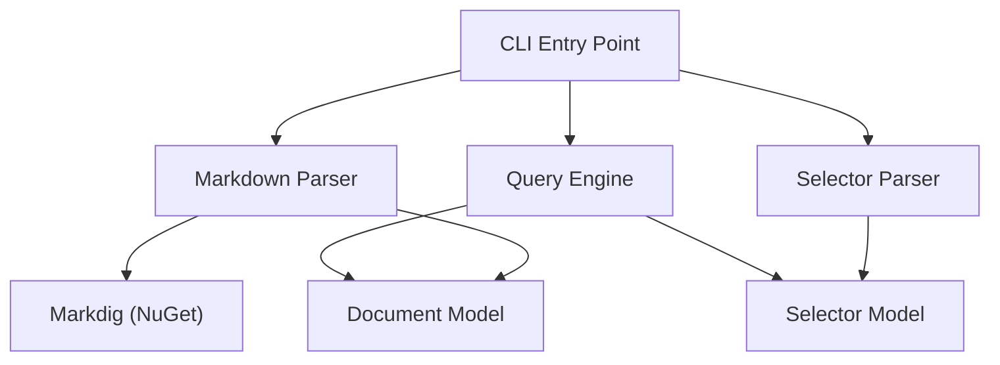
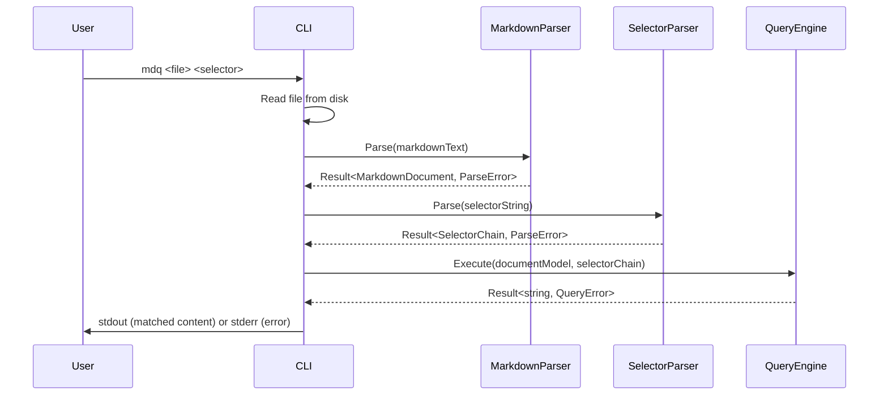
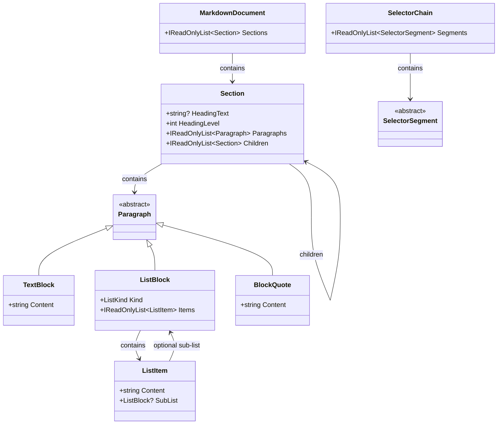
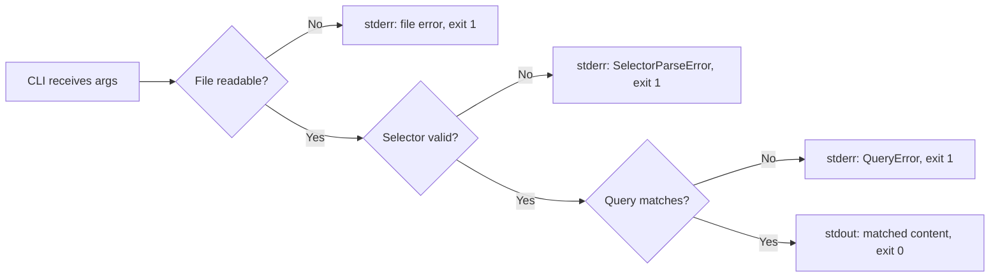

# Design Document: mdq Query Engine

## Overview

mdq is a command-line tool that queries Markdown documents using a selector-based language, similar to how jq works on JSON. Given a Markdown file and a query selector string, mdq parses the Markdown into a tree-structured document model, parses the selector into a chain of segments, executes the chain against the model, and writes the matched content to stdout.

The system is decomposed into four vertical slices that map directly to the requirements:

1. **Markdown Parsing** -- Transforms raw Markdown text into a `MarkdownDocument` tree.
2. **Selector Parsing** -- Transforms a query selector string into a `SelectorChain`.
3. **Query Execution** -- Traverses the `MarkdownDocument` using a `SelectorChain` and returns matched content.
4. **CLI** -- Wires the pipeline together behind a command-line interface.

Each slice is self-contained with its own types, logic, and error types. Cross-cutting concerns (the `Result` type, shared error base) live in a thin shared kernel.

## Architecture

The project follows Clean Architecture with vertical slices. The Markdown parsing layer depends on [Markdig](https://github.com/xoofx/markdig) for CommonMark-compliant parsing; all other core logic (selector parsing, query execution) has no external dependencies. The CLI layer is the only composition root.



### Data Flow



### Project Structure

```
Mdq/
  Mdq.Core/
    Shared/
      Result.cs
      MdqError.cs
    DocumentModel/
      Section.cs
      Paragraph.cs
      ListBlock.cs
      ListItem.cs
      MarkdownDocument.cs
      MarkdownParser.cs
    SelectorModel/
      SelectorSegment.cs
      SelectorChain.cs
      SelectorParser.cs
    QueryEngine/
      QueryExecutor.cs
      QueryError.cs
  Mdq.Cli/
    Program.cs
  Mdq.Tests/
    DocumentModel/
      MarkdownParserTests.cs
      MarkdownParserPropertyTests.cs
    SelectorModel/
      SelectorParserTests.cs
      SelectorParserPropertyTests.cs
    QueryEngine/
      QueryExecutorTests.cs
      QueryExecutorPropertyTests.cs
    Cli/
      CliIntegrationTests.cs
```

## Components and Interfaces

### Shared Kernel

The `Result<T, E>` type is the backbone of error handling. All public methods return `Result` instead of throwing exceptions.

```csharp
// Discriminated union via sealed record hierarchy
public abstract record Result<T, E>
{
    public sealed record Ok(T Value) : Result<T, E>;
    public sealed record Err(E Error) : Result<T, E>;

    public Result<U, E> Map<U>(Func<T, U> f) => this switch
    {
        Ok(var v) => new Result<U, E>.Ok(f(v)),
        Err(var e) => new Result<U, E>.Err(e),
        _ => throw new InvalidOperationException()
    };

    public Result<U, E> Bind<U>(Func<T, Result<U, E>> f) => this switch
    {
        Ok(var v) => f(v),
        Err(var e) => new Result<U, E>.Err(e),
        _ => throw new InvalidOperationException()
    };
}
```

`MdqError` is the base for all error types:

```csharp
public abstract record MdqError(string Message);
```

### MarkdownParser

```csharp
public static class MarkdownParser
{
    public static Result<MarkdownDocument, MarkdownParseError> Parse(string markdown);
}
```

Parses raw Markdown text into a `MarkdownDocument`. Internally delegates to [Markdig](https://github.com/xoofx/markdig) for CommonMark-compliant parsing, then transforms the Markdig AST into our `MarkdownDocument` tree. The transformation:
- Walks the Markdig `MarkdownDocument` block list.
- Maps `HeadingBlock` nodes to section boundaries, using `HeadingBlock.Level` to determine nesting.
- Maps `ParagraphBlock` nodes to `Paragraph.TextBlock`, extracting inline text content.
- Maps `ListBlock` / `ListItemBlock` nodes to `Paragraph.ListBlock` / `ListItem`, including nested sub-lists.
- Maps `QuoteBlock` nodes to `Paragraph.BlockQuote`.
- Builds the section tree by nesting sections under their parent heading level.
- Content before the first heading becomes a root-level `Section` with `HeadingText = null`, `HeadingLevel = 0`.

This approach avoids reimplementing Markdown parsing and lets us focus on the domain-specific tree transformation.

### SelectorParser

```csharp
public static class SelectorParser
{
    public static Result<SelectorChain, SelectorParseError> Parse(string selector);
}
```

Parses a query selector string into a `SelectorChain`. The grammar:

```
selector_chain  = { selector_segment }
selector_segment = heading_selector | content_selector
heading_selector = "#" name
content_selector = ".text" | ".heading" | ".paragraph(" integer ")" | ".item(" integer ")"
name             = <sequence of non-# non-. characters>
integer          = <positive integer>
```

### QueryExecutor

```csharp
public static class QueryExecutor
{
    public static Result<string, QueryError> Execute(
        MarkdownDocument document,
        SelectorChain chain);
}
```

Walks the `SelectorChain` segments left-to-right, narrowing the matched content at each step. Each segment type has a dedicated resolution method to keep the logic flat and readable.

### CLI (Program.cs)

```csharp
// Composition root -- wires the pipeline
// 1. Validate args
// 2. Read file
// 3. Parse markdown
// 4. Parse selector
// 5. Execute query
// 6. Write result to stdout or error to stderr
```

## Data Models

### MarkdownDocument

```csharp
public record MarkdownDocument(IReadOnlyList<Section> Sections);
```

A document is a flat list of top-level sections. Content before the first heading is stored as a `Section` with a `null` heading.

### Section

```csharp
public record Section(
    string? HeadingText,       // null for the root preamble section
    int HeadingLevel,          // 0 for preamble, 1-6 for H1-H6
    IReadOnlyList<Paragraph> Paragraphs,
    IReadOnlyList<Section> Children);
```

Sections form a tree. `Children` contains subsections at the next heading level.

### Paragraph

```csharp
// Discriminated union for paragraph types
public abstract record Paragraph
{
    public sealed record TextBlock(string Content) : Paragraph;
    public sealed record ListBlock(ListKind Kind, IReadOnlyList<ListItem> Items) : Paragraph;
    public sealed record BlockQuote(string Content) : Paragraph;
}

public enum ListKind { Bulleted, Numbered }
```

### ListItem

```csharp
public record ListItem(
    string Content,
    Paragraph.ListBlock? SubList);  // null if no nested list
```

A list item may contain a nested sub-list, enabling recursive `.item(N)` navigation.

### SelectorChain

```csharp
public record SelectorChain(IReadOnlyList<SelectorSegment> Segments)
{
    public bool IsEmpty => Segments.Count == 0;
}
```

### SelectorSegment

```csharp
public abstract record SelectorSegment
{
    public sealed record Heading(string Name) : SelectorSegment;
    public sealed record Text : SelectorSegment;
    public sealed record HeadingContent : SelectorSegment;  // .heading selector
    public sealed record ParagraphAt(int Index) : SelectorSegment;  // 1-indexed
    public sealed record ItemAt(int Index) : SelectorSegment;       // 1-indexed
}
```

### Error Types

```csharp
public record MarkdownParseError(string Message) : MdqError(Message);

public record SelectorParseError(string Message, int Position) : MdqError(Message);

public abstract record QueryError(string Message) : MdqError(Message)
{
    public sealed record HeadingNotFound(string Name, int Level)
        : QueryError($"Heading '{Name}' not found at level {Level}");

    public sealed record ParagraphOutOfRange(int Requested, int Actual)
        : QueryError($"Paragraph {Requested} requested but section has {Actual} paragraphs");

    public sealed record ItemOutOfRange(int Requested, int Actual)
        : QueryError($"Item {Requested} requested but list has {Actual} items");

    public sealed record NotAList()
        : QueryError("The selected paragraph is not a list");
}
```

### Model Relationships



## Correctness Properties

*A property is a characteristic or behavior that should hold true across all valid executions of a system -- essentially, a formal statement about what the system should do. Properties serve as the bridge between human-readable specifications and machine-verifiable correctness guarantees.*

### Property 1: Section tree heading-level invariant

*For any* valid Markdown string, the parsed `MarkdownDocument` shall form a tree where every child `Section`'s `HeadingLevel` is exactly one greater than its parent's `HeadingLevel`, and any content before the first heading appears as a root-level `Section` with `HeadingText == null` and `HeadingLevel == 0`.

**Validates: Requirements 1.1, 1.2**

### Property 2: Paragraph splitting by blank lines

*For any* Markdown section body containing N text blocks separated by two or more consecutive newlines, the parsed `Section` shall contain exactly N `Paragraph` entries.

**Validates: Requirements 1.3**

### Property 3: List and block-quote structure

*For any* Markdown containing a bulleted or numbered list, the parsed model shall represent the entire list as a single `ListBlock` paragraph with one `ListItem` per list entry. *For any* list item that contains an indented sub-list, the `ListItem.SubList` shall be non-null and contain the correct sub-items. *For any* block quote, the parsed model shall represent it as a single `BlockQuote` paragraph.

**Validates: Requirements 1.4, 1.5, 1.6**

### Property 4: Selector parse round-trip

*For any* valid `SelectorChain`, converting it to its string representation and parsing that string back shall produce a `SelectorChain` that is structurally equal to the original. This covers heading selectors, `.text`, `.heading`, `.paragraph(N)`, `.item(N)`, and all valid combinations thereof.

**Validates: Requirements 2.2, 2.4, 2.5, 2.6, 2.7, 2.8**

### Property 5: Invalid selector produces positioned error

*For any* string that does not conform to the selector grammar (including `.paragraph(N)` or `.item(N)` with non-positive or non-integer arguments), the parser shall return an `Err` containing a `SelectorParseError` with a `Position` value that falls within the bounds of the input string.

**Validates: Requirements 2.9, 2.10**

### Property 6: Empty selector returns full document

*For any* `MarkdownDocument`, executing an empty `SelectorChain` shall return a string equal to the full rendered content of the document.

**Validates: Requirements 3.1**

### Property 7: Heading selector returns correct section

*For any* `MarkdownDocument` containing a section with heading text `H` at level `L`, and for any valid chain of heading selectors that navigates to that section, the query result shall contain the heading line, all body paragraphs, and all nested subsections of that section.

**Validates: Requirements 3.2, 3.3**

### Property 8: .text and .heading are complementary views

*For any* `Section` with a heading, querying `.heading` shall return only the heading text (without `#` prefix characters), and querying `.text` shall return the body content excluding the heading line. The concatenation of the heading line and the `.text` result shall equal the full section content.

**Validates: Requirements 3.4, 3.5**

### Property 9: .paragraph(N) returns the Nth paragraph

*For any* `Section` with K paragraphs and *for any* N in [1, K], executing `.paragraph(N)` shall return the content of the Nth paragraph in document order.

**Validates: Requirements 3.6**

### Property 10: .item(N) navigates lists and nested sub-lists

*For any* `ListBlock` with K items and *for any* N in [1, K], executing `.item(N)` shall return the Nth `ListItem`. *For any* chain of `.item(N1).item(N2)...` selectors, each successive `.item()` shall navigate one level deeper into nested sub-lists.

**Validates: Requirements 3.7, 3.8**

### Property 11: Out-of-range paragraph index returns ParagraphOutOfRange

*For any* `Section` with K paragraphs and *for any* N > K, executing `.paragraph(N)` shall return a `ParagraphOutOfRange` error containing both the requested index N and the actual count K.

**Validates: Requirements 3.10**

### Property 12: Out-of-range item index returns ItemOutOfRange

*For any* `ListBlock` with K items and *for any* N > K, executing `.item(N)` shall return an `ItemOutOfRange` error containing both the requested index N and the actual count K.

**Validates: Requirements 3.11**

### Property 13: .item on non-list returns NotAList

*For any* `Paragraph` that is not a `ListBlock`, executing `.item(N)` for any positive N shall return a `NotAList` error.

**Validates: Requirements 3.12**

### Property 14: Heading not found returns HeadingNotFound

*For any* `MarkdownDocument` and *for any* heading name that does not exist at the expected level, executing a heading selector shall return a `HeadingNotFound` error containing the unmatched name and the level searched.

**Validates: Requirements 3.9**

### Property 15: CLI pipeline success

*For any* valid Markdown file on disk and *for any* query selector that matches content in that file, invoking the CLI with those arguments shall write the matched content to stdout and exit with code 0.

**Validates: Requirements 4.2**

## Error Handling

All errors flow through the `Result<T, E>` type. No exceptions are thrown for expected failure conditions. Each vertical slice defines its own error type inheriting from `MdqError`.

### Error Flow



### Error Categories

| Layer | Error Type | Cause | Contains |
|-------|-----------|-------|----------|
| Markdown Parser | `MarkdownParseError` | Malformed input (reserved for future strictness) | Message |
| Selector Parser | `SelectorParseError` | Invalid selector syntax, non-positive index | Message, Position |
| Query Engine | `QueryError.HeadingNotFound` | No section matches the heading name at the expected level | Name, Level |
| Query Engine | `QueryError.ParagraphOutOfRange` | Paragraph index exceeds section's paragraph count | Requested, Actual |
| Query Engine | `QueryError.ItemOutOfRange` | Item index exceeds list's item count | Requested, Actual |
| Query Engine | `QueryError.NotAList` | `.item(N)` applied to a non-list paragraph | -- |
| CLI | I/O error | File not found or unreadable | Message |

### Design Decisions

- **No exceptions for control flow.** Every public method returns `Result<T, E>`. The CLI's `Main` is the only place that pattern-matches on `Result` to decide exit code and output stream.
- **Errors carry context.** `SelectorParseError` includes the character position. `QueryError` subtypes include the requested index and actual count so the user can diagnose the problem without re-reading the document.
- **Fail fast.** The CLI pipeline short-circuits on the first error. There is no attempt to collect multiple errors in a single run.

## Testing Strategy

### Dual Testing Approach

Both unit tests and property-based tests are required. They serve complementary purposes:

- **Unit tests** (NUnit + AwesomeAssertions): Verify specific examples, edge cases, and error conditions. These are the tests for the edge-case and example criteria identified in the prework (empty document, empty selector, file not found, no-args usage, etc.).
- **Property-based tests** (FsCheck + FsCheck.NUnit): Verify universal properties across randomly generated inputs. Each property test maps to exactly one correctness property from this design document.

### Property-Based Testing Configuration

- **Library:** FsCheck with the `FsCheck.NUnit` integration package.
- **Minimum iterations:** 100 per property (configured via `[Property(MaxTest = 100)]`).
- **Tagging:** Each property test must include a comment referencing the design property:
  ```csharp
  // Feature: mdq-query-engine, Property 4: Selector parse round-trip
  [Property(MaxTest = 100)]
  public Property SelectorParseRoundTrip() { ... }
  ```
- **Custom generators (Arbitrary instances):** The test project must define FsCheck `Arbitrary` instances for:
  - `SelectorChain` -- generates valid chains of random segments
  - `MarkdownDocument` -- generates valid document trees with random headings, paragraphs, lists, and nesting
  - `ListBlock` -- generates lists with optional nested sub-lists
  - Invalid selector strings -- generates strings that violate the grammar

### Test Organization

| Test Class | Scope | Type |
|-----------|-------|------|
| `MarkdownParserTests` | Specific Markdown inputs, edge cases (empty doc, preamble, block quotes) | Unit |
| `MarkdownParserPropertyTests` | Properties 1, 2, 3 | Property |
| `SelectorParserTests` | Specific selector strings, edge cases (empty selector, invalid syntax examples) | Unit |
| `SelectorParserPropertyTests` | Properties 4, 5 | Property |
| `QueryExecutorTests` | Specific query scenarios, edge cases (heading not found, out-of-range, not-a-list) | Unit |
| `QueryExecutorPropertyTests` | Properties 6, 7, 8, 9, 10, 11, 12, 13, 14 | Property |
| `CliIntegrationTests` | End-to-end CLI invocation, Property 15, edge cases (no args, bad file, bad selector) | Integration |

### Required NuGet Packages

- `Markdig` (Markdown parsing -- referenced by `Mdq.Core`)
- `NUnit` (test framework)
- `NUnit3TestAdapter` (test runner)
- `AwesomeAssertions` (readable assertions)
- `FsCheck` (property-based testing engine)
- `FsCheck.NUnit` (NUnit integration for FsCheck)
